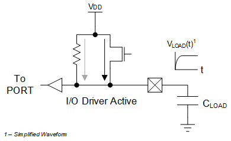

<!-- Please do not change this html logo with link -->

# Simple I2C I/O Expander with PIC16F15245
This code example demonstrates the use of the PIC16-152 family of parts to build a simple 8-bit I/O expander that is optimized for I2C control.

## Related Documentation

* <a href="https://www.microchip.com/wwwproducts/en/PIC16F15245">PIC16F15245 Documentation</a>
* <a href="https://github.com/microchip-pic-avr-examples/pic16f15245-advanced-i2c-io-expander">Code Example: Advanced I/O Expander with the PIC16F15245</a>

## Software Used

* <a href="http://www.microchip.com/mplab/mplab-x-ide">MPLAB® IDE 5.40 or newer</a>
* <a href="https://www.microchip.com/mplab/compilers">Microchip XC8 Compiler 2.20 or newer</a>
* PIC16F1xxxx_DFP v1.4.119

## Hardware Used

### Common Components

* <a href="https://www.microchip.com/developmenttools/ProductDetails/PartNO/ADM00559"> I2C Master Device (or for easy testing, an MCP2221A USB-UART/I2C breakout module, PN: ADM00559)</a>

### With the PIC16F15245 on a Curiosity LPC Board

* <a href="https://www.microchip.com/DevelopmentTools/ProductDetails/PartNO/DM164137"> Microchip Low Pin Count Curiosity, PN: DM164137</a>  

**Important:**
1. RC0 is connected to a potentiometer on RC0. This may cause the pin to be stuck at Vdd/Vss. 
2. RC1 is connected to the mTouch(TM) button. It is possible to couple enough charge through this button to trigger the IOC circuit on this pin.
3. RC5 is one of the LEDs on-board. The weak pull-up current may go through this LED, causing unexpected behavior in devices that use the weak pull-up.
4. RA5 is another one of the LEDs on-board. The open-drain line isn't strong enough to hold the line with this LED. Disabling OPEN DRAIN on the INT pin will resolve the issue. 

### With the Curiosity Nano (PIC16F15244)

* <a href="#"> Microchip Curiosity Nano, PN: ???</a>

**Important setup instructions:**
1. Change the build configuration to the appropriate configuration ending with PIC16F15244. 

 

2. Run Build and Clean on the project. (Hammer + Broom on the toolbar).  

## Setup

 
*Figure 1 - Electrical Configuration of device. Shown with Address Lines tied to GND.* 

On the PIC16-152, the default positions for the pins and ports are:

| Function  | Pin or PORT
| --------- | ----
| SDA       | RB4
| SCL       | RB6
| INT       | RB5
| ADDR0     | RA0
| ADDR1     | RA1
| ADDR2     | RA2
| I/O       | PORTC

*Important! The addressing lines are only sampled on Power-up. If the address needs to be updated at run-time, then a RESET of the microcontroller is required.*

## I2C Default settings

**I2C base address:** 0x60 
**I2C speed:** 100kHz

*Note: The I2C base address can be changed in config.h*

## Operation
To reduce the amount of data sent, this example has in essence, 2 modes:

* A strong GND output
* A weak Vdd Input

### Strong GND Output

The strong GND output is created from the I/O driver on the device. **The limits of this driver are specified in the datasheet.** Generally, this mode can sink current in the range of mA.

### Weak Vdd Input

The weak Vdd input is created from the internal pull-up resistors on the device. These resistors cannot supply a lot of current, however they are used to define the logic level of each pin when it is open, preventing it from being a random value.

### Transitioning

When moving from GND to Vdd, the parasitic capacitance of the pin and connected circuits causes it to transition slowly. 

 

To accelerate the process, the device briefly turns on the high-side I/O driver to help recharge the parasitic capacitance. 

 

The number of wait loops that the I/O driver runs for is specified in *config.h*. For simplicity, the I2C interrupt is used to block during this time, as the delay is very brief. The constant `DELAY_COUNT` in *config.h* represents the number of iterations.

***For longer delays, it is recommended to use one of the timer peripherals on board to control the transitions.***

 
*No Delay (natural rise time)* 
 
*Delay constant of 10* 
 
*Delay constant of 20* 

For the images above, a capacitor of 4.7uF was attached to the I/O pin. **This is an extreme case to demonstrate the differences in delay time.**

## Communication
The simplified nature of this example means that the I2C write and read operations represent the only 2 possible operations.

**In the case of writes**, the 1st data byte sent indicates the direction of each pin. Bytes sent after this are ACK'ed, but not used by the program.

  * For instance, writing the value 0b1000 0101 (0x85) would set Pin 7, 2, and 0 to be inputs with all other pins being outputs.

 

**In the case of reads**, each byte read is the value in the I/O register PORTx. There is no restriction on the number of read requests.

* For instance, reading the value 0b1001 0010 (0x92) indicates a logic '1' on Pin 7, 4, and 1, while the other pins are at a logic '0'.

 

### External Interrupts
If any pin changes I/O state, then the INT line is asserted to '0'. This only applies to pins that are assigned as an input. Any I2C activity with this device will clear the assertion on the STOP condition.

In *config.h*, the INT line can be configured as Open-Drain or as Push-Pull. In Push-Pull, logic 0 is still used as asserted, and logic 1 is used as not asserted.

## Summary
This code example demonstrates the utility of parts such as the PIC16-152 in ultra-low cost applications where flexibility is key.
